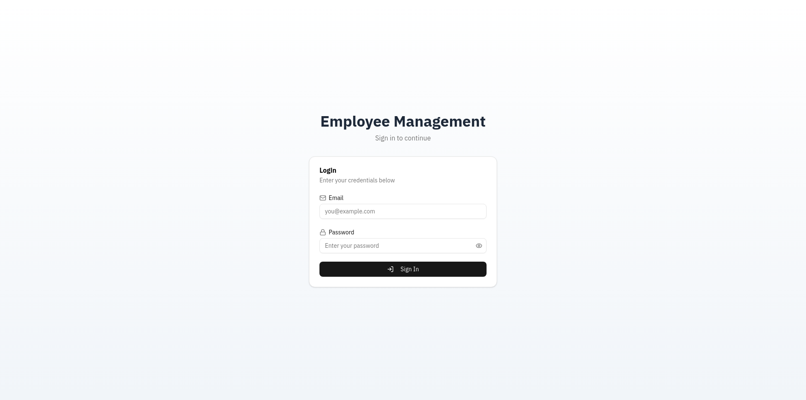
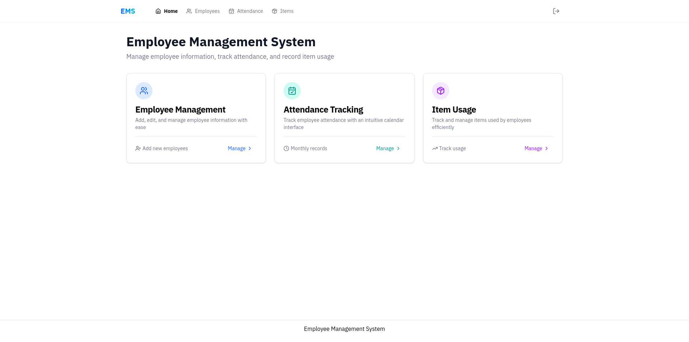
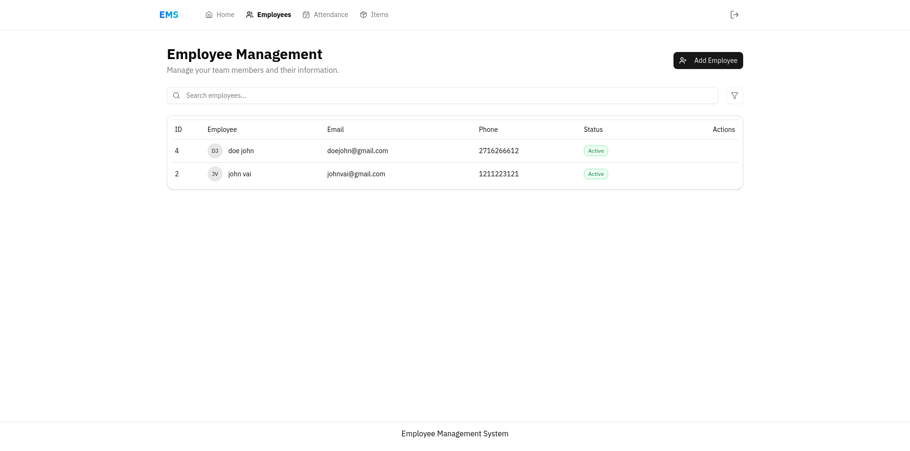
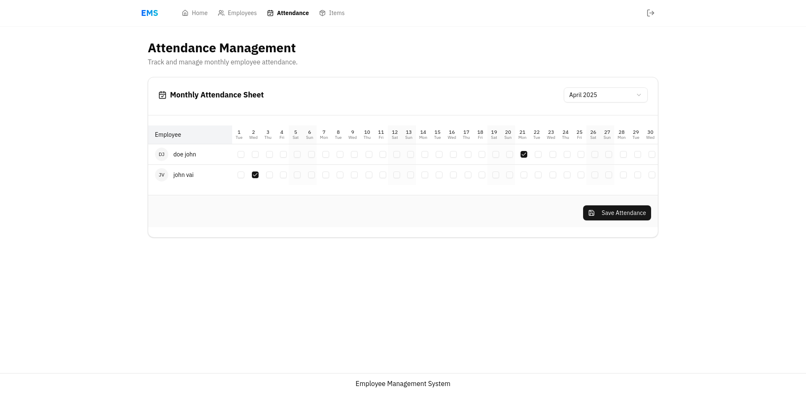
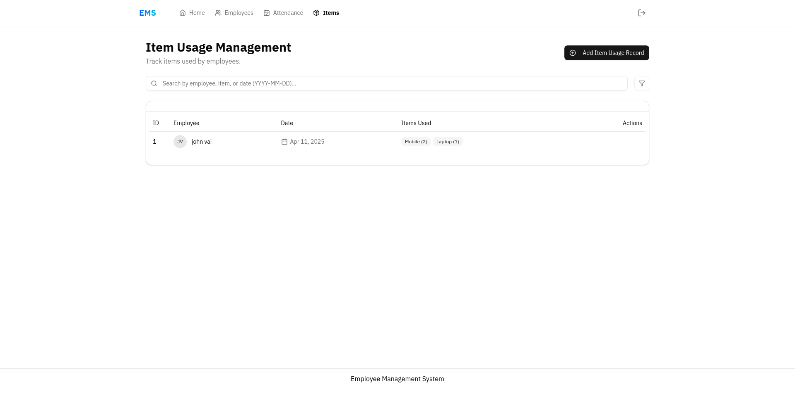

# Employee Management System (EMS)

## Project Overview

This is a full-stack web application for managing basic employee information, tracking attendance, and recording item usage. It uses React for the frontend and .NET Core for the backend API.

## Features:
- User Authentication (Login/Logout with JWT)
- Employee CRUD (Create, Read, Update, Delete) operations
- Item Usage CRUD operations
- Monthly Attendance Tracking (Grid View, Checkboxes)

## Tech Stack

- **Frontend:** React (with Vite), TypeScript, React Router, Axios, Formik, Yup, Sonner (for toasts), date-fns, Tailwind CSS, shadcn/ui
- **Backend:** .NET 9 (Minimal API), C#, Dapper, PostgreSQL, DB Up (for migrations), JWT Bearer Authentication, ASP.NET Core Identity (implicitly via JWT)
- **Database:** PostgreSQL

## Screenshots

## Backend Setup & Usage

### Prerequisites:
- .NET 9 SDK (or the version specified in global.json/csproj)
- PostgreSQL Server (running locally or accessible)
- A PostgreSQL database created (e.g., 'employee_management_db')
- A PostgreSQL user with permissions on the database

### Setup Steps:
1.  **Clone Repository**
2.  **Navigate to Backend:** `cd employee-management-backend`
3.  **Configure Connection String:**
    -   Open `appsettings.Development.json`.
    -   Update the `ConnectionStrings.DefaultConnection` value with your actual PostgreSQL host, port, database name, username, and password.
4.  **Configure JWT Settings:**
    -   Open `appsettings.Development.json`.
    -   Update `JwtSettings.SecretKey` with a strong, unique secret key (at least 32 characters). **DO NOT use the default development key in production.** Use User Secrets or Environment Variables for production secrets.
    -   Update `JwtSettings.Issuer` and `JwtSettings.Audience` to match your expected API URL (e.g., `https://localhost:7167` for local dev).
5.  **Trust Development Certificate (if using HTTPS):**
    -   Run `dotnet dev-certs https` 
6.  **Build Project:** Run `dotnet build`.
7.  **Run Migrations & Start API:**
    -   Run `dotnet run --launch-profile https` (or the profile matching your HTTPS setup in `launchSettings.json`).
    -   The first time you run, DB Up should automatically create the necessary database tables (`Users`, `Employees`, `ItemUsageRecords`, `ItemUsageDetails`, `AttendanceRecords`). Check the console output for success messages.
8.  **API Access:** The API should now be running (e.g., `https://localhost:7167`). You can access the Swagger UI documentation at `/swagger` (e.g., `https://localhost:7167/swagger`).

### Backend Project Structure:
- `/Endpoints`: Contains endpoint mapping extensions (Auth, Employees, etc.).
- `/Models`: Contains C# model classes (User, Employee, etc.) and DTOs.
- `/Repositories`: Contains data access logic using Dapper (UserRepository, etc.).
- `/Scripts`: Contains `.sql` migration scripts executed by DB Up.
- `/Services`: Contains business logic services (PasswordService, TokenService, etc.).
- `Program.cs`: Main application entry point, DI configuration, middleware setup.
- `appsettings.json / *.Development.json`: Configuration files.
- `Properties/launchSettings.json`: Development launch profiles.

## Frontend Setup & Usage

### Prerequisites:
- Node.js and npm (or yarn/pnpm) installed.

### Setup Steps:
1.  **Navigate to Frontend:** `cd employee-management-ui` (or your frontend folder name)
2.  **Install Dependencies:** Run `npm install` (or `yarn install` / `pnpm install`).
3.  **Configure API URL:**
    -   Create a `.env` file in the frontend project root.
    -   Add the line `VITE_API_BASE_URL=https://localhost:7167` (replace with your actual running backend HTTPS URL).
4.  **Run Development Server:** Run `npm run dev` (or `yarn dev` / `pnpm dev`).
5.  **Access Application:** Open your browser and navigate to the URL provided by Vite (usually `http://localhost:5173`).

### Frontend Project Structure:
- `public/`: Static assets.
- `src/`: Main application source code.
  - `assets/`: Images, fonts, etc.
  - `components/`:
      - `common/`: Generic, reusable UI pieces.
      - `layout/`: Structural components (MenuBar, MainLayout).
      - `ui/`: Components generated by shadcn/ui.
  - `constants/`: Mock data or constant values.
  - `contexts/`: React Context providers (AuthContext).
  - `features/`: Feature-specific modules (auth, employees, itemUsage, attendance). Contains pages, feature-specific components.
  - `hooks/`: Global custom hooks.
  - `lib/`: Library configurations (axios instance).
  - `router/`: Routing setup (routes, ProtectedRoute).
  - `services/`: API interaction functions (authService, employeeService, etc.).
  - `styles/`: Global styles, Tailwind base.
  - `types/`: TypeScript type definitions.
  - `utils/`: Helper functions.
  - `App.tsx`: Root application component.
  - `main.tsx`: Application entry point.
- `.env`: Environment variables (API URL).
- `tailwind.config.js`, `postcss.config.js`: Tailwind configuration.
- `tsconfig.json`: TypeScript configuration.
- `vite.config.ts`: Vite build configuration.
- `package.json`: Project dependencies and scripts.

### Usage:
1.  Register a user via the backend Swagger UI (`/swagger`) using the `/api/auth/register` endpoint initially.
2.  Access the frontend application URL.
3.  Log in using the credentials you registered.
4.  Navigate using the menu bar to access different features (Employees, Item Usage, Attendance).